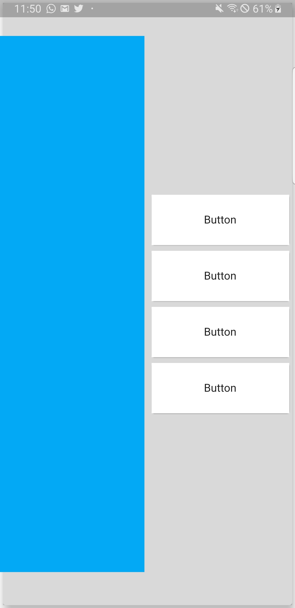

# flutter_custom_drawer

a fully customizable slider like drawer

##Screenshots




### Example
```
void main() => runApp(
  MaterialApp(
    home: MyApp(),
  )
);


class MyApp extends StatelessWidget{
  @override
  Widget build(BuildContext context) {
    var size = MediaQuery.of(context).size;
    return Scaffold(
        body: ModernDrawer(
          drawWidth: size.width * 0.5,
          topAndBottom: size.height * 0.05,
          backgroundWidget: Container(
            color: Colors.black.withOpacity(0.2),
            alignment: Alignment.centerRight,
            child: Container(
              alignment: Alignment.center,
              width: size.width * 0.48,
              child: Column(
                mainAxisAlignment: MainAxisAlignment.center,
                children: <Widget>[
                  Card(
                    elevation: 4,
                    child: Container(
                      height: 70,
                      alignment: Alignment.center,
                      child: Text(
                        "Button",
                        style: TextStyle(
                          color: Colors.black,
                          fontWeight: FontWeight.bold,
                          fontSize: 17
                        ),
                      ),
                    ),
                  ),
                  Card(
                    elevation: 4,
                    child: Container(
                      height: 70,
                      alignment: Alignment.center,
                      child: Text(
                        "Button",
                        style: TextStyle(
                          color: Colors.black,
                          fontWeight: FontWeight.bold,
                          fontSize: 17
                        ),
                      ),
                    ),
                  ),
                  Card(
                    elevation: 4,
                    child: Container(
                      height: 70,
                      alignment: Alignment.center,
                      child: Text(
                        "Button",
                        style: TextStyle(
                          color: Colors.black,
                          fontWeight: FontWeight.bold,
                          fontSize: 17
                        ),
                      ),
                    ),
                  ),
                  Card(
                    elevation: 4,
                    child: Container(
                      height: 70,
                      alignment: Alignment.center,
                      child: Text(
                        "Button",
                        style: TextStyle(
                          color: Colors.black,
                          fontWeight: FontWeight.bold,
                          fontSize: 17
                        ),
                      ),
                    ),
                  ),
                ],
              ),
            ),
          ),
          foregroundWidget: Container(
            color: Colors.lightBlue,
            width: size.width,
            height: size.height,
          ),
        ),
    );
  }
}
```

## Getting Started

This project is a starting point for a Dart
[package](https://flutter.dev/developing-packages/),
a library module containing code that can be shared easily across
multiple Flutter or Dart projects.

For help getting started with Flutter, view our 
[online documentation](https://flutter.dev/docs), which offers tutorials, 
samples, guidance on mobile development, and a full API reference.
